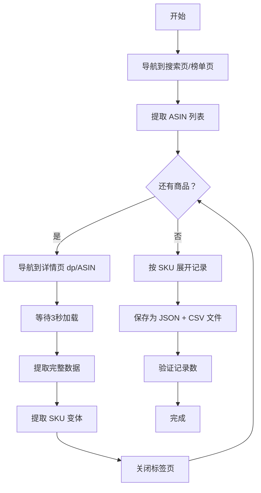

# 亚马逊商品数据抓取指南（详情页完整版）

> ⚠️ **重要提示**：本文档是 cross-border-selection 技能的配套参考资料。
> ❗**严重错误案例**：第一次执行时只在列表页抓取，导致缺失评分、销量、卖点、规格等关键字段。
> ✅**正确做法**：必须为每个商品导航到详情页 `https://www.amazon.com/dp/{ASIN}`

---

## 目录

1. [核心原则](#核心原则)
2. [完整工作流程](#完整工作流程)
3. [列表页：提取 ASIN 列表](#列表页提取-asin-列表)
4. [详情页：提取完整数据](#详情页提取完整数据)
5. [SKU 变体提取](#sku-变体提取)
6. [数据保存](#数据保存)
7. [数据验证](#数据验证)

---

## 核心原则

### 三级数据提取机制

```
优先级1: 列表页 → 仅用于提取 ASIN 列表
         ↓
优先级2: 详情页 → 提取完整数据（必须访问）
         ↓
优先级3: 备用方案 → curl + 正则表达式（当浏览器失败时）
```

### 必须访问详情页的字段

以下字段**仅存在于详情页**，列表页无法获取：

| 字段 | 列表页 | 详情页 | 选择器 |
|------|------|------|------|
| 商品评分 | ❌ 无 | ✅ 有 | `[data-hook="rating"] span.a-alt-text` |
| 评论数 | ❌ 无 | ✅ 有 | `#acrCustomerReviewText` |
| 销量 | ❌ 无 | ✅ 有 | `#averageCustomerReviews .a-size-base` |
| 商品卖点 | ❌ 无 | ✅ 有 | `#feature-bullets .a-list-item` |
| 商品规格 | ❌ 无 | ✅ 有 | `#productDetails_todgyTable tr` |
| SKU 变体 | 部分 | 完整 | `[data-asin]` |

---

## 完整工作流程



---

## 列表页：提取 ASIN 列表

### JavaScript 代码

```javascript
// 在搜索列表页执行
() => {
    const asins = [];
    const items = document.querySelectorAll('.s-result-item[data-asin]');

    for (const item of items) {
        const asin = item.getAttribute('data-asin');
        if (asin && asin.length === 10) {
            // 跳过广告和赞助商品
            const sponsored = item.querySelector('[class*="sponsored"]');
            if (!sponsored) {
                asins.push(asin);
            }
        }
    }

    return asins.slice(0, 5); // 返回前5个商品
}
```

### 使用示例

```javascript
const use_browser = await navigator.useBrowser();

// 导航到搜索页
await use_browser({
    action: 'navigate',
    url: `https://www.amazon.com/s?k=${encodeURIComponent(keyword)}`
});

await use_browser({
    action: 'wait_for',
    timeMs: 3000
});

// 提取 ASIN 列表
const asinList = await use_browser({
    action: 'evaluate',
    fn: extractAsinsFromSearchPage.toString()
});

console.log(`找到 ${asinList.length} 个商品:`, asinList);
```

---

## 详情页：提取完整数据

### 完整提取函数

```javascript
/**
 * 从亚马逊商品详情页提取完整数据
 * @returns {Object} 商品数据对象
 */
function extractProductDetail() {
    const data = {
        asin: '',
        title: '',
        price: '',
        rating: '',
        reviewCount: '',
        sales: '',
        bulletPoints: [],
        mainImage: ''
    };

    // 1. 提取标题
    const titleEl = document.querySelector('#productTitle');
    if (titleEl) {
        data.title = titleEl.textContent.trim().replace(/\s+/g, ' ');
    }

    // 2. 提取价格
    const priceEl = document.querySelector('.a-price .a-offscreen');
    if (priceEl) {
        data.price = priceEl.textContent.trim();
    }

    // 3. 提取评分（仅详情页有）
    const ratingEl = document.querySelector('[data-hook="rating"] span.a-alt-text');
    if (ratingEl) {
        const match = ratingEl.textContent.match(/([\d.]+)\s*out of/);
        if (match) {
            data.rating = match[1];
        }
    }

    // 4. 提取评论数（仅详情页有）
    const reviewCountEl = document.querySelector('#acrCustomerReviewText');
    if (reviewCountEl) {
        const match = reviewCountEl.textContent.match(/([\d,.KMB]+)/);
        if (match) {
            data.reviewCount = match[1];
        }
    }

    // 5. 提取销量（仅详情页有）
    const salesEl = document.querySelector('#averageCustomerReviews .a-size-base');
    if (salesEl) {
        const text = salesEl.textContent;
        const match = text.match(/(\d+\+?)\s*customers?\s*bought\s*in\s*past\s*month/i);
        if (match) {
            data.sales = match[1] + '+ bought in past month';
        }
    }

    // 6. 提取商品卖点（Bullet Points，仅详情页有）
    const bullets = document.querySelectorAll('#feature-bullets .a-list-item');
    data.bulletPoints = Array.from(bullets)
        .map(el => el.textContent.trim().replace(/\s+/g, ' '))
        .filter(t => t.length > 20 && !t.includes('CSS') && !t.includes('$'));

    // 7. 提取主图
    const imgEl = document.querySelector('#landingImage');
    if (imgEl) {
        data.mainImage = imgEl.dataset.oldHires || imgEl.src;
    }

    return data;
}
```

### 使用示例

```javascript
// 对每个 ASIN，导航到详情页
for (const asin of asinList) {
    console.log(`\n处理商品：${asin}`);

    // 导航到详情页
    await use_browser({
        action: 'navigate',
        url: `https://www.amazon.com/dp/${asin}`
    });

    // 等待页面加载
    await use_browser({
        action: 'wait_for',
        timeMs: 3000
    });

    // 提取完整数据
    const productData = await use_browser({
        action: 'evaluate',
        fn: extractProductDetail.toString()
    });

    console.log(`标题：${productData.title}`);
    console.log(`价格：${productData.price}`);
    console.log(`评分：${productData.rating}`);
    console.log(`评论：${productData.reviewCount}`);
    console.log(`销量：${productData.sales || '暂无'}`);
    console.log(`卖点数量：${productData.bulletPoints.length}`);

    // 关闭当前标签页，准备处理下一个
    await use_browser({
        action: 'close_tab'
    });
}
```

---

## SKU 变体提取

### 变体选择器识别

亚马逊商品的 SKU 变体通常在以下位置：

1. **尺寸选择器**：`.twisterPlusSwatchImageMainParent`
2. **颜色选择器**：`.swatchElement`
3. **价格显示**：`.a-price .a-offscreen`

### 提取函数

```javascript
/**
 * 提取商品的所有 SKU 变体信息
 * @returns {Array} 变体数组
 */
function extractVariants() {
    const variants = [];
    const seenAsins = new Set();

    // 查找所有带 data-asin 的元素
    const variantElements = document.querySelectorAll('[data-asin]');

    variantElements.forEach(el => {
        const vasin = el.dataset.asin;

        // 去重和验证
        if (!vasin || vasin.length !== 10 || seenAsins.has(vasin)) {
            return;
        }
        seenAsins.add(vasin);

        // 1. 提取尺寸信息
        let sizeName = '';
        const parent = el.closest('.twisterPlusSwatchImageMainParent, .swatchElement');

        if (parent) {
            const dimText = parent.textContent;

            // 匹配尺寸格式：35"x22" 或 35.0"Lx22.0"W
            const dimMatch = dimText.match(/(\d+\.?\d*)["']?\s*[xX×]\s*(\d+\.?\d*)["']?\s*(L|W|H|Th)?/i);
            if (dimMatch) {
                sizeName = `${dimMatch[1]}"x${dimMatch[2]}"`;
            }

            // 如果没有匹配到尺寸，尝试找颜色名称
            if (!sizeName) {
                const colorEl = parent.querySelector('.a-color-base, .a-button-selected');
                if (colorEl) {
                    sizeName = colorEl.textContent.trim().substring(0, 50);
                }
            }
        }

        // 2. 提取变体价格
        let variantPrice = '';
        const vPriceEl = el.querySelector('.a-price .a-offscreen');
        if (vPriceEl) {
            variantPrice = vPriceEl.textContent.trim();
        }

        // 3. 添加到结果
        variants.push({
            asin: vasin,
            size: sizeName || vasin,
            price: variantPrice
        });
    });

    return variants;
}
```

### 变体命名规范

生成的 SKU 名称应该清晰易读：

```javascript
// 好的命名
"35\"x22\" - Green Flower"
"41\"x28\" - Blue"
"XS (20\"x20\"x6\")"
"M (up to 45lbs)"

// 避免的命名
"B0F6LQHT1M"  // 只有 ASIN
"Green"       // 太模糊
"35"          // 缺少单位
```

---

## 数据保存

### JSON 格式（完整结构化数据）

```python
import json
import os
from datetime import datetime

output_dir = f"amazon_selection/{keyword}_{datetime.now().strftime('%Y%m%d')}"
os.makedirs(output_dir, exist_ok=True)

with open(f"{output_dir}/products.json", "w", encoding="utf-8") as f:
    json.dump(products, f, ensure_ascii=False, indent=2)
```

### CSV 格式（按 SKU 展开，便于 Excel）

```python
import csv

csv_fields = [
    "sku", "parent_asin", "title", "price", "rating", "reviews",
    "sales", "bullet_points", "specifications", "image_url", "product_url"
]

with open(f"{output_dir}/products.csv", "w", encoding="utf-8-sig", newline="") as f:
    writer = csv.DictWriter(f, fieldnames=csv_fields)
    writer.writeheader()
    writer.writerows(rows)
```

**注意：** CSV 使用 `utf-8-sig` 编码（带 BOM），确保 Excel 打开时中文不乱码。

---

## 数据验证

### 记录数验证

```python
def validate_record_count(products_data, actual_count):
    """验证保存的记录数是否正确"""
    expected_count = sum(len(p.get("variants", [1])) for p in products_data)

    if expected_count != actual_count:
        print(f"⚠️ 记录数不匹配！")
        print(f"   预期：{expected_count} 条")
        print(f"   实际：{actual_count} 条")
        return False

    print(f"✅ 记录数验证通过：{actual_count} 条")
    return True
```

### 字段完整性验证

```python
def validate_record_fields(record):
    """验证单条记录的字段完整性"""
    required_fields = [
        "sku", "parent_asin", "title", "price",
        "rating", "reviews", "sales", "bullet_points", "specifications"
    ]

    missing = []
    for field in required_fields:
        value = record.get(field)
        if not value or (isinstance(value, str) and len(value.strip()) == 0):
            missing.append(field)

    if missing:
        print(f"⚠️ 字段缺失：{missing}")
        return False

    return True
```

---

## 常见错误与解决方案

### 错误1：只在列表页抓取

**症状：** 缺失评分、销量、卖点、规格数据

**解决：**
```javascript
// ❌ 错误：在列表页执行
const items = document.querySelectorAll('.s-result-item');

// ✅ 正确：导航到详情页
await use_browser({
    action: 'navigate',
    url: `https://www.amazon.com/dp/${asin}`
});
```

### 错误2：每个商品只创建1条记录

**症状：** 记录数不足，遗漏 SKU 变体

**解决：**
```python
# ❌ 错误：每个商品只写1条
for product in products:
    records.append(create_record(product))

# ✅ 正确：每个 SKU 写1条
for product in products:
    for variant in product["variants"]:
        records.append(create_record(variant))
```

### 错误3：SKU 命名不规范

**症状：** SKU 列只有 ASIN，没有尺寸/颜色信息

**解决：**
```python
# ❌ 错误
sku_name = variant["asin"]

# ✅ 正确
sku_name = f"{variant['size']} - {variant['color']}"
```

---

## 性能优化建议

### 批量处理

```javascript
// 推荐：批量提取，减少浏览器操作次数
const allProducts = [];
for (const asin of asinList) {
    await navigateToDetail(asin);
    const data = await extractProductDetail();
    const variants = await extractVariants();
    allProducts.push({...data, variants});
    await closeTab();
}
```

### 缓存机制

```python
# 使用缓存避免重复抓取
cache_file = "amazon_cache.json"

if os.path.exists(cache_file):
    with open(cache_file) as f:
        cached_data = json.load(f)
else:
    cached_data = {}
    # 抓取并保存到缓存
```

---

## 参考资料

- cross-border-selection SKILL.md - 技能主文档

---

**文档版本:** v5.0
**更新时间:** 2026-03-20
**关联技能:** cross-border-selection
